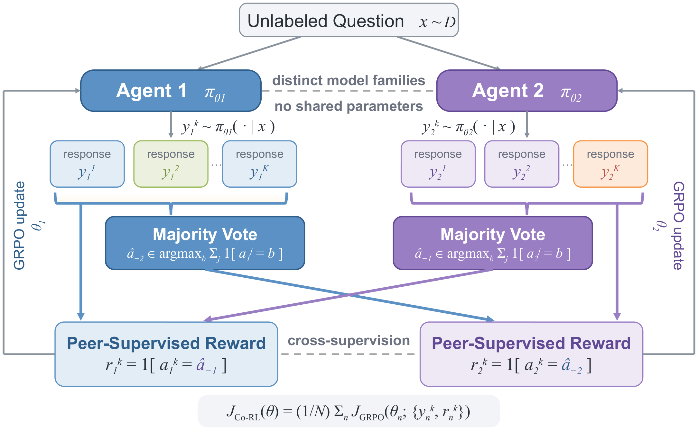
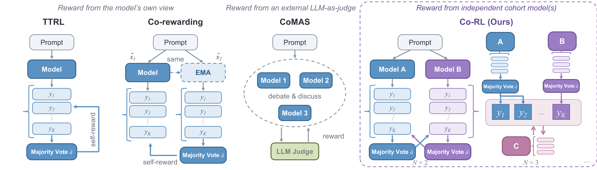

<h1 align="center">
    Co-RL: Unsupervised Reasoning Emerges from Diverse Cohort in Multi-agent RL
</h1>

<p align="center">
    Implementation for the paper "Co-RL: Unsupervised Reasoning Emerges from Diverse Cohort in Multi-agent RL".
</p>

<p align="center">
    <a href="https://github.com/DrStranded/Co-RL"> </a>
    <a href="LICENSE"> </a>
</p>



Reinforcement learning (RL) has emerged as a powerful approach for improving reasoning in language and vision-language models, yet its strongest successes still depend heavily on ground-truth supervision. Self-rewarding RL reduces this dependence by enabling models to derive reward signals from their own completions, but training solely on self-generated feedback can reinforce existing biases, reduce response diversity, and lead to training collapse. We show that unsupervised reasoning can emerge through cooperative multi-agent training. Co-RL simultaneously optimizes multiple decoupled models, sharing no parameters, through RL using rewards derived from their peers. Increasing cohort diversity — through heterogeneous model families, sizes, and rephrased training samples — reduces the correlated errors that drive self-reinforcing feedback loops, consistently improves reasoning performance, and mitigates collapse. Across text-only and multimodal domains, Co-RL outperforms the base models and prior label-free approaches while matching or surpassing supervised methods, without access to any ground-truth labels: average gains of 3.0–8.6% across seven text-only benchmarks for LLMs and 2.3–7.2% across four multimodal benchmarks for VLMs.



## 📰 News

- **[2026/08]** Our code implementation is released on [GitHub](https://github.com/DrStranded/Co-RL).

## 📁 Repository Structure

- [`llm/`](llm/) — text-LLM experiments on MATH-Level345: GT-Reward, TTRL, RENT, Intuitor baselines and Co-RL in three settings — Co-RL (Same family), Co-RL (Different family), and Co-RL (Different family+), which adds data decoupling through rephrased training prompts.
- [`mllm/`](mllm/) — vision-language experiments on open-r1 and MMR1: GT-Reward, TTRL, and Co-RL (Different family), with the four-benchmark evaluation suite.

In `llm/`, `trainers/co_rl/` holds Co-RL, `trainers/self_rewarding/` the
label-free baselines (TTRL, RENT, Intuitor), and `trainers/grpo/` the GT-Reward
reference; `mllm/trainers/` is flat, with the Co-RL and single-model entry
points side by side.

Each directory is self-contained, with its own dependency freeze, launchers, and README.

## ⚙️ Configuration

```bash
git clone https://github.com/DrStranded/Co-RL
cd Co-RL/llm      # or: cd Co-RL/mllm
pip install -r requirements.txt
python tools/verify.py
```

Both stacks target CUDA 12.8 (Python 3.12 for `llm/`, 3.11 for `mllm/`); `verify.py` asserts the installed versions match the paper runs.

## 🚀 Training

Each `examples/` directory holds one launcher per method. **These are
illustrative configurations** — small model pairs, short rollout budgets, and a
step cap so a run finishes quickly. The configuration behind the reported
numbers is given in the paper; override any of it through the environment
(`MODEL_A`, `MODEL_B`, `BS`, `GA`, `MAX_STEPS`, `DATASET`).
Text LLMs:

All launchers gate on an env flag so a half-configured shell fails fast:
export `LLM_ENV_READY=1` (text) or `MLLM_ENV_READY=1` (vision-language) once
the environment is active, plus `HF_TOKEN` for gated models. The
vision-language launchers additionally need `MLLM_PRE_DIR`, `MLLM_EVAL_PATH`,
and `MLLM_EVAL_IMAGE_DIR`, all printed by `setup/prepare_data.sh` when it
finishes.

```bash
cd llm
bash examples/ttrl_qwen25_1p5b.sh               # TTRL baseline
bash examples/same_family_qwen25_1p5b.sh                       # Co-RL (Same family)
bash examples/different_family_qwen25_1p5b_x_llama32_1b.sh         # Co-RL (Different family)
```

Vision-language models:

```bash
cd mllm
bash setup/prepare_data.sh                            # once, preprocess both training sets
bash examples/ttrl_qwen25vl3b.sh               # TTRL baseline
bash examples/different_family_qwen25vl3b_x_internvl35_2b.sh   # Co-RL (Different family)
```

Every launcher documents its batch arithmetic in its header and supports a one-step smoke via `MAX_STEPS=1`. Experiments run on 8 x 80GB GPUs per node.

## 📊 Evaluation

Text LLMs are scored on a seven-benchmark reasoning suite (GSM8K, MATH-500, AMC, HumanEval, MBPP, GPQA-Diamond, LiveCodeBench) through `llm/eval/`.

Vision-language models are scored on MathVision, MathVerse, MathVista, and We-Math with greedy decoding and rule-based grading:

```bash
cd mllm
export VLLM_WORKER_MULTIPROC_METHOD=spawn
python eval/prepare_benchmarks.py all
bash eval/run_eval_all.sh --model [checkpoint] --prompt boxed --gpu 0 --out_dir [dir]
```

## 📜 Citation

## 🙏 Acknowledgements

Built on [TRL](https://github.com/huggingface/trl), [vLLM](https://github.com/vllm-project/vllm),
and [DeepSpeed](https://github.com/deepspeedai/DeepSpeed); evaluation uses
[lm-evaluation-harness](https://github.com/EleutherAI/lm-evaluation-harness),
[LiveCodeBench](https://github.com/LiveCodeBench/LiveCodeBench), and
[mathruler](https://github.com/hiyouga/mathruler). Math grading is derived from
[Qwen2.5-Math](https://github.com/QwenLM/Qwen2.5-Math), [open-r1](https://github.com/huggingface/open-r1),
and [prm800k](https://github.com/openai/prm800k). See [NOTICE](NOTICE) for the full list.

Please consider citing our paper if you find it helpful:

```bibtex
@article{yang2026corl,
  title={Co-RL: Unsupervised Reasoning Emerges from Diverse Cohort in Multi-agent RL},
  author={Yang, Yunhao and Bian, Yuexin and Tian, Yunjie and Fu, Di and Huang, Tianjin and Shi, Yuanyuan and Xiao, Ziang and Vasconcelos, Nuno and Li, Yijiang},
  year={2026}
}
```
